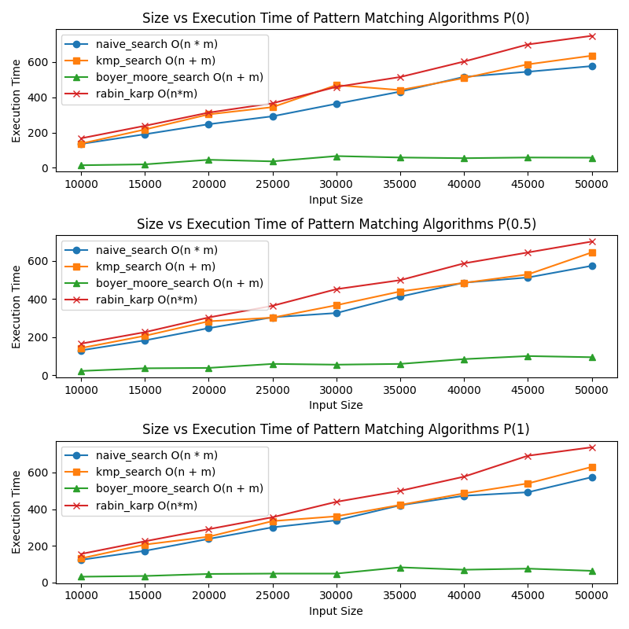
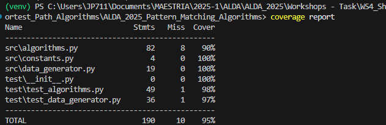

# ALDA_2025_Shortest_Path_Algorithms

Este proyecto implementa y evalúa diferentes algoritmos de búsqueda de patrones en cadenas de texto. A continuación, se detalla la estructura del proyecto, una explicación de los algoritmos implementados y su complejidad en notación O.

---

## Estructura de Carpetas

. ├── .coverage # Coverage report file ├── app.py # Main script to execute the analysis and plot results ├── README.md # Project documentation ├── requirements.txt # Project dependencies ├── run.sh # Script to run the main program ├── test.sh # Script to run unit tests ├── media/ # Folder containing generated images │ ├── Coverage.png │ ├── DataTable.png │ ├── Result.png │ └── ResultsSize1000.png ├── src/ # Source code │ ├── algorithms.py # Implementation of pattern matching algorithms │ ├── constants.py # Constants used in the project │ ├── data_generator.py # Random text and pattern generator │ ├── execution_time_gathering.py # Execution time measurement │ └── pycache/ # Compiled Python files └── test/ # Unit tests ├── __init__.py ├── test_algorithms.py # Tests for pattern matching algorithms ├── test_data_generator.py # Tests for the data generator └── pycache/ # Compiled Python files


---

## Algorithms Implemented

### 1. **Naive Search**
This algorithm sequentially compares the pattern with every substring of the text.

- **Complexity:**
  - Best case: O(n) (when the pattern is not present in the text).
  - Average case: O(n * m) (when the pattern is present and differs from the text).
  - Worst case: O(n * m) (when the pattern is present and matches the text).

### 2. **Knuth-Morris-Pratt (KMP)**
The KMP algorithm uses a prefix array to avoid redundant comparisons.

- **Complexity:**
  - Best case: O(n) (when the pattern is not present in the text).
  - Average case: O(n).
  - Worst case: O(n + m).

### 3. **Boyer-Moore**
This algorithm uses heuristics like the "bad character rule" to skip unnecessary comparisons.

- **Complexity:**
  - Best case: O(n) (when the pattern is not present in the text).
  - Average case: O(n).
  - Worst case: O(n * m).

### 4. **Rabin-Karp**
The Rabin-Karp algorithm uses a hash function to compare the pattern with substrings of the text.

- **Complexity:**
  - Best case: O(n) (when the pattern is not present in the text).
  - Average case: O(n).
  - Worst case: O(n * m).

---

## Virtual Environment Setup and Usage

### What is a Virtual Environment?

A virtual environment is an isolated Python environment that allows you to manage dependencies for your project without affecting the global Python installation. It ensures that your project uses the correct versions of libraries and avoids conflicts with other projects.

### Creating a Virtual Environment

To create a virtual environment for this project, follow these steps:

1. Open a terminal in the project directory.
2. Run the following command to create the virtual environment:

   ```sh
   python -m venv venv
   ```
This will create a folder named [`venv`](/venv) in the project directory.

3. Activate the virtual environment:
    ```sh
    venv/bin/activate
    ```
4. Install the required dependencies:
    ```sh
    pip3 install -r requirements.txt
    ```
Importance of a Virtual Environment:
- Dependency Management: Ensures that the project uses the correct versions of libraries specified in requirements.txt.
- Isolation: Prevents conflicts between dependencies of different projects.
- Reproducibility: Makes it easier for others to set up and run the project with the same environment.

## Testing

The project includes unit tests to ensure the correctness of the implemented algorithms and the data generator. The tests are located in the `test/` directory and are written using Python's `unittest` framework.

### Running the Tests

1. To run all tests, execute the following command:
   ```sh
   ./test.sh
   ```

### Test Coverage
The tests cover the following aspects:

- Pattern Matching Algorithms: Ensures that each algorithm correctly identifies patterns in the text and handles edge cases.
- Data Generator: Verifies that the generated text and patterns meet the specified constraints (e.g., length, probability).

## Results and Conclusions
### Experiment Overview
The figure above shows the execution time of four different pattern matching algorithms — Naive Search, Knuth-Morris-Pratt (KMP), Boyer-Moore, and Rabin-Karp — across different input sizes and pattern probabilities:

- Top Plot: Pattern probability = 0.0 (pattern is not present)

- Middle Plot: Pattern probability = 0.5 (pattern is occasionally present)

- Bottom Plot: Pattern probability = 1.0 (pattern is always present)



### Algorithms Tested
🔵 naive_search — O(n * m)

🟠 kmp_search — O(n + m)

🟢 boyer_moore_search — O(n + m)

🔴 rabin_karp — O(n * m)

### Observations
Boyer-Moore consistently outperformed all other algorithms in every scenario, showing the lowest execution times, even with increasing input size and pattern frequency.

KMP and Naive Search had similar performance for lower input sizes, but as the size increased, KMP performed slightly better, especially with higher pattern frequency.

Rabin-Karp performed the worst in all cases, showing significantly higher execution time, likely due to its hashing overhead and collision handling.

The presence of the pattern (controlled by the pattern probability P) influenced the performance of all algorithms, especially the naive approach, which performs worst when the pattern is always present.

### Conclusions
Boyer-Moore is the most efficient algorithm in practice, regardless of pattern frequency or input size.

KMP is a solid alternative, especially when preprocessing is acceptable and memory use is a concern.

Naive search is only suitable for small-scale problems or when simplicity is preferred.

Rabin-Karp should be avoided for large inputs unless hashing optimization is specifically beneficial for the application.

##  Coverage

Coverage generates a report showing what percentage of each code file was covered during testing. The report also shows a summary of the total coverage for the entire project. In this case, 95% of the code was covered during testing.

